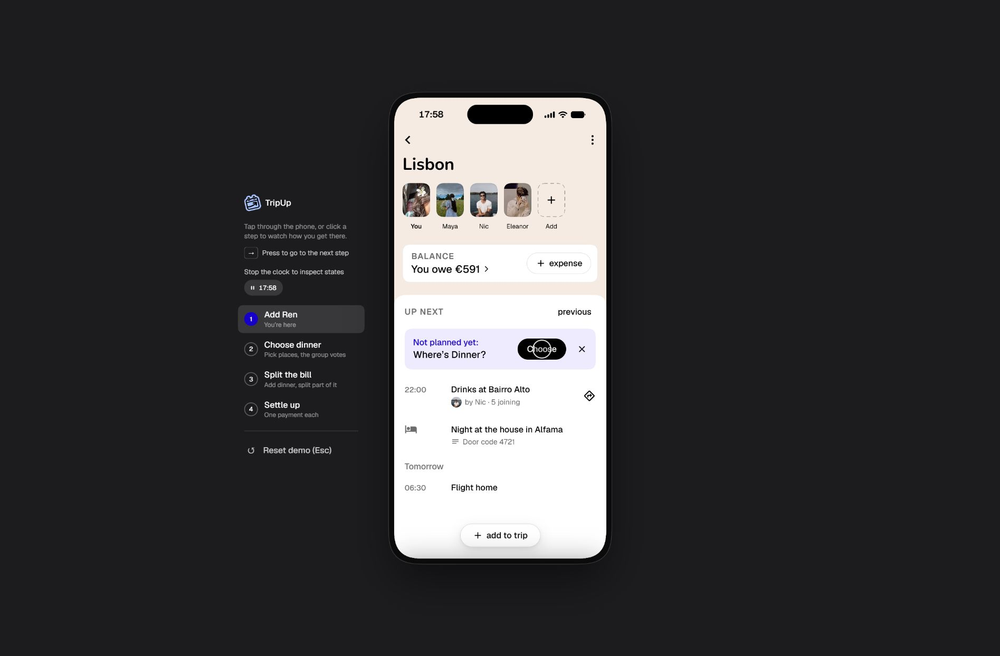

# TripUp

An interactive group travel prototype by **Marek Ševčík**. Follow a group in Lisbon as they plan an evening, vote on activities, split expenses, and settle up.

**[Open the live prototype →](https://tripup-demo-marek-sevcik.vercel.app/)**



## Explore the demo

The prototype opens directly on the Lisbon trip. Try the dinner vote, add an expense with a custom split, review the group balance, and explore the simulated payment flow. Trip members, schedules, expenses, and payment details are demonstration data.

The presentation controls let you adjust the pace and restart the scenario. **Esc** resets the demo. On a phone, normal scrolling and pinch zoom remain available; double tapping no longer zooms the interface.

## Run locally

Use **Node.js 22 or newer**. No npm packages or environment variables are required.

```sh
npm run dev
```

Open [localhost:3000](http://localhost:3000). To validate the source and expense calculations:

```sh
npm run check
npm test
```

## Project structure

| Location | Purpose |
| --- | --- |
| `src/index.html` | Exported interface templates and page metadata |
| `src/prototype.js` | Demo state, interactions, itinerary, voting, and expense logic |
| `src/styles.css` | Design tokens, fonts, layout, and motion |
| `static/assets/` | Images, icons, fonts, and bundled browser runtimes |
| `static/resource-map.js` | Maps resource identifiers from the export to local assets |
| `scripts/` | Dependency-free build, local server, and validation tools |
| `tests/` | Tests for expense allocation and the initial demo state |

`npm run build` assembles a deployable site in `public/`. That generated folder is excluded from Git. Vercel builds and deploys the main branch using `vercel.json`; GitHub Actions runs the checks and tests.

## Scope and implementation

This repository preserves the supplied design export and its interactions. The application source, styles, and assets have been separated from the original single-file bundle so they can be inspected and edited. The exported DC template runtime renders the interface with bundled React 18.3.1. See [the architecture notes](docs/ARCHITECTURE.md) for the rendering and state model.

This is a browser prototype: payments, invitations, group updates, and connected services are simulated. There is no server, authentication, shared database, or real payment processing. Progress is saved in browser local storage; it does not sync across devices. Discovery pictures use Wikimedia Commons and LoremFlickr and may depend on network availability.

The original assets and vendor code retain their existing rights and notices. See [third-party notices](THIRD_PARTY_NOTICES.md).
